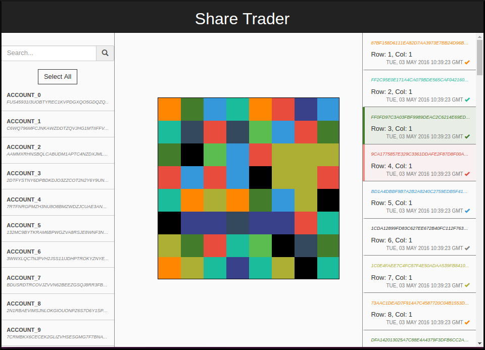

# BigchainDB Examples

[]()
[](http://bigchaindb-examples.readthedocs.io/en/latest/?badge=latest)
[](https://gitter.im/bigchaindb/bigchaindb?utm_source=badge&utm_medium=badge&utm_campaign=pr-badge&utm_content=badge)

This repo contains examples and tutorials for BigchainDB.

__Warning__: These examples are for demonstration purposes and should not be used as-is for production

See the [documentation](http://bigchaindb-examples.readthedocs.io/en/latest/index.html):
* [Installing](http://bigchaindb-examples.readthedocs.io/en/latest/install.html)
* [Running](http://bigchaindb-examples.readthedocs.io/en/latest/run.html)
* [Troubleshooting](http://bigchaindb-examples.readthedocs.io/en/latest/troubleshooting.html)

Examples:
* [On the Record](#example-on-the-record)
* [Share Trader](#example-share-trader)
* [Interledger](#example-interledger)

### Dependencies

The examples can be [run via Docker](http://bigchaindb-examples.readthedocs.io/en/latest/install.html#the-docker-way)
(**recommended**), but, if you'd like, you can also [run them locally](http://bigchaindb-examples.readthedocs.io/en/latest/install.html#install-from-source)
with the following system dependencies:

 - OS dependencies: see [setup BigchainDB & RethinkDB](https://bigchaindb.readthedocs.io/en/latest/installing-server.html#install-and-run-rethinkdb-server)
 - python>=3.4
 - node>=5.3 using [nvm](https://github.com/creationix/nvm#installation) (**recommended**), or [manually](https://nodejs.org/en/download/)
 - [npm>=3.3](https://docs.npmjs.com/getting-started/installing-node) (should be installed with node)

## Quick start


### Docker

To run via Docker, set up your docker environment as necessary and:

```bash
$ make
```

**Note**: If using docker-machine, you'll have to run `make` with your docker-machine ip:

```bash
$ DOCKER_MACHINE_IP=$(docker-machine ip) make
```

The app will be available at <http://localhost:33000> (replace ``localhost`` with your
docker-machine ip as necessary).

### Locally

If you'd like to run these examples locally (preferably in a virtualenv), you can do so using
the handy CLI:

```bash
$ bigchaindb-examples --help

# Start everything
$ bigchaindb-examples start --init --all

# Reset everything
$ bigchaindb-examples reset-all
```

The app will be available at <http://localhost:3000>.

## Example: "On the Record"

"On the Record" is a simple logging app, wrapped as a messaging board.

<p align="center">
  
</p>

### Use cases

- Immutable logging of data
- Notarization of data, text, emails

### Functionality

#### Create assets
- with arbitrary payload
- and an unlimited amount

#### Retrieve assets
- that you currently own (like UTXO's)
- by searching the asset data/payload
- state indicator (in backlog vs. on bigchain)

#### What this app doesn't provide

- Proper user and key management
- Transfer of assets

## Example: Share Trader

Share Trader is a simple share allocation and trade app. Each square represents an asset that can be traded amongst accounts.

<p align="center">
  
</p>

### Use cases

- Reservation of tickets, seats in a concert/transport, ...
- Trade of limited issued assets

### Functionality

#### Create assets
- assets are created following a structured payload
- the amount is limited

#### Transfer assets
- easy transfer of assets between accounts by:
 - clicking on an account first. This will give the assets for that account
 - clicking on an asset of that account. Transfer actions will appear on the right side.

#### Retrieve assets
- that you currently own (like UTXO's)
- all assets on bigchain
- state indicator (blinks if asset has various owners)

#### What this app doesn't provide

- Proper user and key management
- Proper signing of transfers
- Proper search by payload

## Example: Interledger

TODO

## Acknowledgements:

Special thanks to the BigchainDB/ascribe.io team for their insights and code contributions:

@r-marques, @vrde, @ttmc, @rhsimplex, @SohKai, @sbellem, @TimDaub
